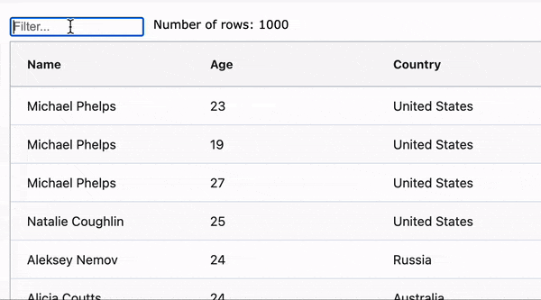

# Understanding async tests in Angular

This repo contains a sample application that uses [AG Grid](ag-grid.com) to display a list of Olympic medal winners. This data can be filtered using the [Quick Filter Text](https://ag-grid.com/angular-data-grid/filter-quick/) feature as provided with the grid.  

It complements the dev.to article [Understanding async tests in Angular](https://dev.to/angular/understanding-async-tests-in-angular-f8n)



The application tests that we can filter our data to a specific country of interest. Our test will validate that:

1. Our grid shows the full set of 1000 rows and our application displays the row count of 1000.
1. Upon entering the text "Germany" the grid should filter the rows to only show German athletes
3. Our application row count should update to 68 (the number of German athletes).

The reason for choosing this application is that it contains asynchronous code making it virtually impossible to test synchronously. 

## Async Test Examples

The test code can be found in the [app.component.spec.ts](https://github.com/StephenCooper/async-angular-testing/blob/main/async-testing-app/src/app/app.component.spec.ts) file.

You can run the tests from the `async-testing-app` folder.

```ts
npm install
npm run test
```


