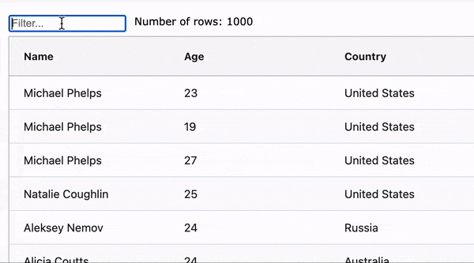

# Angular fakeAsync

If you are testing an Angular application, then at some point, you will be required to test asynchronous behaviour. In this article we will demonstrate how to write an asynchronous test with both `fakeAsync` and `async`/`await`. We will explain each step in detail to give you the understanding and confidence to write your own asynchronous tests.

## Application for our Test

We will be testing an application that uses [AG Grid](https://ag-grid.com/). Our application displays a table of Olympic medal winners and also provides users with a text box to filter the medal winners by any field. You can try the application out for yourself [here](https://plnkr.co/edit/ef2ozOyGVZlvT2wq?open=app%2Fapp.component.ts).



We are going to test that we can filter our data to a specific country of interest. Our test will validate that:

1. Our grid shows the full set of 1000 rows and our application displays the row count of 1000.
1. Upon entering the text "Germany" the grid should filter the rows to only show German athletes
3. Our application row count should update to 68 (the number of German athletes).

The reason for choosing this application, is that it contains asynchronous code making it virtually impossible to test synchronously. 

## Application Code

In our application we have a text input box that is bound to the `quickFilterText` property of our component. We display the current number of rows in our template and we pass the `quickFilterText` to our grid component so that it can filter its rows as required.

```html
<input id="quickFilter" type="text" [(ngModel)]="quickFilterText"/>

<div id="numberOfRows">Number of rows: {{ displayedRows }}</div>

<ag-grid-angular #grid
  [quickFilterText]="quickFilterText"
  (modelUpdated)="onModelUpdated($event)"
></ag-grid-angular>
```

The number of rows will be kept up to date by using the grid callback `(modelUpdated)`. This is fired every time the grid model is updated, including when filtering is performed.

```ts
export class AppComponent implements OnInit {
  public displayedRows: number = 0;
  public quickFilterText: string = '';

  @ViewChild('grid') grid: AgGridAngular;

  onModelUpdated(params: ModelUpdatedEvent) {
    this.displayedRows = params.api.getDisplayedRowCount();
  }
}

```

### Test helpers

Before we get to the tests let me quickly explain the assertion helper function we will be using. This function will give us an insight into the inner workings of our test, especially when we start working with asynchronous callbacks. 

The function validates the following:

- internal grid state
- state of the component variable, i.e `displayedRows`
- rendered HTML output of the `{{ displayedRows }}` binding

We will see that these values do *not* update in sync due to asynchronous callbacks and if change detection is required to have run to update the property.

```ts
function validateState({ gridRows, displayedRows, templateRows }) {
  
    // Validate the internal grid model by calling its api method to get the row count
    expect(component.grid.api.getDisplayedRowCount())
      .withContext('api.getDisplayedRowCount')
      .toEqual(gridRows)
    
    // Validate the component property displayedRows
    expect(component.displayedRows)
      .withContext('component.displayedRows')
      .toEqual(displayedRows)

    // Validate the rendered html content that the user would see 
    expect(rowNumberDE.nativeElement.innerHTML)
      .withContext('<div> {{displayedRows}} </div>')
      .toContain("Number of rows: " + templateRows)
}
```

The `.withContext()` is a helpful Jasmine method to give us clearer error messages when values are not equal.

## Configuring the Test Module

 The first part of the test is to configure the test module. It requires AG Grid's `AgGridModule` and also Angular's `FormModule` to provide support for `ngModel`.
 
 ```ts
beforeEach(() => {
  TestBed.configureTestingModule({
    declarations: [AppComponent],
        imports: [AgGridModule, FormsModule],
    });
    // Create the test component fixture
    fixture = TestBed.createComponent(AppComponent);
    component = fixture.componentInstance;
    let compDebugElement = fixture.debugElement;

    // Get a reference to the quickFilter input and rendered template
    quickFilterDE = compDebugElement.query(By.css('#quickFilter'))
    rowNumberDE = compDebugElement.query(By.css('#numberOfRows'))
});
 ```
An important thing to note here is what is missing from `beforeEach`. We have purposefully not included `fixture.detectChanges()` as part of our setup logic. By doing this we ensure that all our tests are as isolated and it enables us to make assertions on our component before it is initialised. Finally, and most importantly, when working with `fakeAsync` we do not want our component to be created outside of our test's `fakeAsync` context. If we do this, we can end up with all sorts of test inconsistencies and bugs.

> Note that we do not run fixture.detectChanges() inside the beforeEach method! This can lead to numerous issues when testing asynchronous code!
## Broken Synchronous Test

To prove that we need to handle this test asynchronously, let's first try to write the test synchronously.

```ts
it('should filter rows by quickfilter (sync version)', (() => {

    // When the test starts our test harness component has been created but not our child grid component
    expect(component.grid).toBeUndefined()
    // Our first call to detectChanges, causes the grid to be created
    fixture.detectChanges()
    // Grid has now been created
    expect(component.grid.api).toBeDefined()

    // Run change detection to update template
    fixture.detectChanges()

    validateState({ gridRows: 1000, displayedRows: 1000, templateRows: 1000 })
  }))
```

While it looks like this test should pass it does not. We would expect that by the point we call `validateState` each assertion would correctly show 1000 rows. However, only the internal grid model has 1000 rows and both the component property and rendered output display 0. This results in the following test errors:

```py
Error: component.displayedRows: Expected 0 to equal 1000.
Error: <div> {{displayedRows}} </div>: Expected 'Number of rows: 0 for' to contain 1000.
```

This happens because the grid setup code runs synchronously and so has completed before our assertion. However, the component property is still 0 because the grid callback is asynchronously and is still in the Javascript event queue when we reach the assertion statement, i.e it has not run yet.

If you are not familiar with the Javascript event queue and how asynchronous tasks are run then you may find it beneficial to read these articles:
 - [JavaScript Visualized: Event Loop](https://dev.to/lydiahallie/javascript-visualized-event-loop-3dif)
 - [Tasks, microtasks, queues and schedules](https://jakearchibald.com/2015/tasks-microtasks-queues-and-schedules/)

As we cannot even validate the starting state of our test synchronously it is clear that we are going to need to update our tests to correctly handle asynchronous callbacks. 

# Writing an Async Test

We are going to cover two approaches for writing our test that handles the asynchronous grid behaviour:

 - Using `fakeAsync`
 - Using `async` `await`

## FakeAsync

As asynchronous code is very common, Angular provides us with the [fakeAsync](https://angular.io/api/core/testing/fakeAsync) test utility. It enables us to control the flow of time and when asynchronous tasks are executed with the methods `tick()` and `flush()`.

The high-level concept with `fakeAsync` is that when the test comes to execute an asynchronous task, it is added into a time-based queue instead of being executed. As a developer, we can then choose when the tasks are run. If we want to run all the currently queued async tasks we call `flush()`. As the name suggests this flushes all the queued tasks executing them as they are removed from the queue. 

If we have code that uses a timeout, for example `setTimeout(() => {}, 500)`, then this will be added to the fake async queue with a time delay of 500. We can use the `tick` function to advance time by a set amount. This will walk through the queue and execute tasks that are scheduled before this time delay. Tick gives us more control over how many tasks are removed from the queue as compared to flush.

It is worth noting that there is also a `flushMicrotasks()` function. For an example of when you might use `flushMicrotasks` instead of `flush` take a look at this article [Angular Testing Flush vs FlushMiscrotasks](https://www.damirscorner.com/blog/posts/20210702-AngularTestingFlushVsFlushMicrotasks.html).

### Controlling Change Detection in our test

You will see the following line of code `fixture.detectChanges()` in a lot of Angular tests. This enables you to control when change detection is run. As part of change detection, Input bindings receive their updated values and Html templates are re-rendered with updated component values. Each of these is important when you want to validate that code is working correctly. In the test code below, we will highlight why we are required to call `fixture.detectChanges()` at multiple stages. 

## Quick Filter Test with FakeAsync

We will now walk through the full `fakeAsync` test to validate our application correctly filters data and updates the number of displayed rows. 

### Test setup

The first thing to do is wrap our test body in `fakeAsync`. This causes all async functions to be patched so that we can control their execution.

```ts
import { fakeAsync, flush } from '@angular/core/testing';

it('should filter rows by quickFilterText', fakeAsync(() => {
    ...
}))
```

At the start of our test, our application component has been created but it has not been initialised. i.e `ngOnInit` has not run. This means that our `<ag-grid-angular>` component has not been created yet. To validate this, we can test that the grid is undefined.

The first call to `fixture.detectChanges()`, will create the grid and pass the component values to the grid via its @Inputs. When working with `fakeAsync` ensure the first call to `fixture.detectChanges()` is within the test body and **NOT** in a `beforeEach` section. This is vital as it means that during the construction of the grid all async function calls are correctly patched. 

```ts
// At the start of the test the grid is undefined
expect(component.grid).toBeUndefined()

// Initialise our app component which creates our grid
fixture.detectChanges()

// Validate that the grid has now been created
expect(component.grid.api).toBeDefined()
```

Next, we validate that the internal grid model is correct. It should have 1000 rows. At this point, the asynchronous grid callbacks have not run. i.e the (modelUpdated) @Output has not fired. This is why the internal grid state has 1000 rows, but the component and template still have 0 values.
```ts
// Validate the synchronous grid setup code has been completed but not any async updates
validateState({ gridRows: 1000, displayedRows: 0, templateRows: 0 })
```

To run the callbacks, that are currently in the fake task queue, we call `flush()`. This executes all the async tasks that were added during the initialisation of the grid and also any others that are created during the flush itself until the task queue is empty. Async tasks may create new async tasks as they are executed. Be default `flush()` will attempt to drain the queue of these newly added calls up to a default limit of 20 turns. If for some reason your async tasks trigger other async tasks more than 20 times you can increase this limit by passing it to flush. i.e `flush(100)`.

```ts
// Flush all async tasks from the queue
flush();
```

Now the component has its `displayedRows` property updated by the `(modelUpdated)` event handler. However, this is not reflected in the template as change detection has not yet run. For the rendered template to reflect the updated component property we need to trigger change detection.

Our test state is now consistent. The internal grid model, component data and renderer template all correctly show 1000 rows before any filtering is applied.

```ts
// Validate that our component property has now been updated by the onModelUpdated callback
validateState({ gridRows: 1000, displayedRows: 1000, templateRows: 0 })
// Force the template to be updated
fixture.detectChanges()
// Component state is stable and consistent
validateState({ gridRows: 1000, displayedRows: 1000, templateRows: 1000 })
```
### Update Filter Text

Now it's time to enter text into the filter. We set the filter value to 'Germany' and fire the input event which is required for `ngModel` to react to the filter change.

At this point, the text input has been updated but the grid input binding, [quickFilterText]="quickFilterText", has not been updated as that requires change detection to run. This is why even the internal grid model still reports 1000 rows after the filter change.

```ts
// Mimic user entering Germany
quickFilterDE.nativeElement.value = 'Germany'
quickFilterDE.nativeElement.dispatchEvent(new Event('input'));

// Input [quickFilterText]="quickFilterText" has not been updated yet so grid is not filtered
validateState({ gridRows: 1000, displayedRows: 1000, templateRows: 1000 })
```

We now run change detection which passes the text 'Germany' to the grid input [quickFilterText]="quickFilterText". We then validate that the internal number of rows has been reduced to 68 as the grid filters asynchronously. However, the `displayedRows` property has not been updated as grid callbacks are asynchronous and sitting in the task queue.

```ts
// Run change detection to push new filter value into the grid component
fixture.detectChanges()
// Grid uses filter value to update its internal model
validateState({ gridRows: 68, displayedRows: 1000, templateRows: 1000 })
```

We now `flush` our async task queue which causes the event handler `(modelUpdated)` to fire and update our component's `displayedRows` property. We then run change detection to update the template with the new value.

Our component test state is once again stable and we can validate that our quick filter and model update logic is correct.

```ts
//flush all the asynchronous callbacks.
flush()
// Component property is updated as the callback has now run
validateState({ gridRows: 68, displayedRows: 68, templateRows: 1000 })

// Run change detection to reflect the changes in our template
fixture.detectChanges()
validateState({ gridRows: 68, displayedRows: 68, templateRows: 68 })
```

## Full Test Code

Here is a more concise version of the test without all the intermediary validation steps. Hopefully it is now clear why we have this repeating pattern of `detectChanges` -> `flush` -> `detectChanges`. In both cases you can think of it as: update component inputs, run async tasks of, and then update the template with the resulting values. 

```ts
it('should filter rows by quickFilterText using fakeAsync', fakeAsync(() => {
    
    // Setup grid, run async tasks, update HTML
    fixture.detectChanges()
    flush();
    fixture.detectChanges()

    // Validate full set of data is displayed
    validateState({ gridRows: 1000, displayedRows: 1000, templateRows: 1000 })

    // Update the filter text input
    quickFilterDE.nativeElement.value = 'Germany'
    quickFilterDE.nativeElement.dispatchEvent(new Event('input'));

    // Push filter text to grid, run async tasks, update HTML
    fixture.detectChanges()
    flush()
    fixture.detectChanges()

    // Validate correct number of rows are shown for our filter text
    validateState({ gridRows: 68, displayedRows: 68, templateRows: 68 })

  }))
```

### Using Auto Detect Changes

Now that we understand the data flow in the test above we can simplify the test by using [fixture.autoDetectChanges()](https://angular.io/guide/testing-utility-apis#componentfixture-methods). 

> When autodetect is true, the test fixture calls detectChanges immediately after creating the component. Then it listens for pertinent zone events and calls detectChanges accordingly.
The default is false. Testers who prefer fine control over test behaviour tend to keep it false.

```ts
it('should filter rows by quickFilterText using fakeAsync auto', fakeAsync(() => {

    // Setup grid and start aut detecting changes, run async tasks and have HTML auto updated 
    fixture.autoDetectChanges()
    flush();

    // Validate full set of data is displayed
    validateState({ gridRows: 1000, displayedRows: 1000, templateRows: 1000 })

    // Update the filter text input, auto detect changes updates the grid input
    quickFilterDE.nativeElement.value = 'Germany'
    quickFilterDE.nativeElement.dispatchEvent(new Event('input'));

    // Run async tasks, with auto detect then updating HTML
    flush()

    // Validate correct number of rows are shown for our filter text
    validateState({ gridRows: 68, displayedRows: 68, templateRows: 68 })
  }))
```

As you can see, writing the test with auto-detect, hides a lot of complexity and so may be a good starting point for your asynchronous tests. Just be aware you will lose precise control of when change detection is run.

## Using async await

Another way that we can test our application is to use the built-in [`async` and `await` syntax](https://developer.mozilla.org/en-US/docs/Web/JavaScript/Reference/Statements/async_function) along with the fixture method `fixture.whenStable()`. This can at times be a simpler way to write async tests as you do not have to worry about manually running async tasks. 

Its worth noting that there are cases when it is impossible to write a test with `fakeAsync`. If any of the executed code has a recursive setTimeout being used as a polling timeout, then the fakeAsync task queue can never empty during a flush. Each time a task is removed and executed it add a new one to the queue indefinitely. This is why you may run into the following error. 

```py
Error: flush failed after reaching the limit of 20 tasks. Does your code use a polling timeout?
```

If you run into this situation you may have more success with the `async` and `await` approach.

Let's now re-write our test to work with `async` and `await`.

```ts
it('should filter rows by quickFilterText (async version)', (async () => {

    // Grid is created
    expect(component.grid).toBeUndefined()
    fixture.detectChanges()
    expect(component.grid.api).toBeDefined()

    // At this point in the test we see that the async callback onModelUpdated has not run
    validateState({ gridRows: 1000, displayedRows: 0, templateRows: 0 })

    // We wait for the fixture to be stable which allows all the asynchronous code to run.
    await fixture.whenStable()

    // Callbacks have now completed and our component property has been updated
    validateState({ gridRows: 1000, displayedRows: 1000, templateRows: 0 })
    // Run change detection to update the template
    fixture.detectChanges()
    validateState({ gridRows: 1000, displayedRows: 1000, templateRows: 1000 })

    // Now let's test that updating the filter text input does filter the grid data.
    // Set the filter to Germany
    quickFilterDE.nativeElement.value = 'Germany'
    quickFilterDE.nativeElement.dispatchEvent(new Event('input'));

    // We force change detection to run which applies the update to our <ag-grid-angular [quickFilterText] Input.
    fixture.detectChanges()

    // Async tasks have not run yet
    validateState({ gridRows: 68, displayedRows: 1000, templateRows: 1000 })

    // Again we wait for the asynchronous code to complete
    await fixture.whenStable()
    validateState({ gridRows: 68, displayedRows: 68, templateRows: 1000 })
    // Force template to update
    fixture.detectChanges()
    // Final test state achieved.
    validateState({ gridRows: 68, displayedRows: 68, templateRows: 68 })
  }))
```

As you may have noticed the structure of the test is very similar and we have just basically replaced `flush` with `await fixture.whenStable`. However, under the hood, these tests are running in very different ways so this will not be a straight swap in many other examples.

Here is a concise version using `autoDetectChanges` which is our shortest working test so far. It is also conceptually the most simple to understand and hides a lot of the complexity from the tester. 

```ts
  it('should filter rows by quickFilterText (async version)', (async () => {
    
    // Run initial change detection and start watching for changes
    fixture.autoDetectChanges()
    // Wait for all the async task to complete before running validation
    await fixture.whenStable()

    validateState({ gridRows: 1000, displayedRows: 1000, templateRows: 1000 })

    // Set the filter to Germany
    quickFilterDE.nativeElement.value = 'Germany'
    quickFilterDE.nativeElement.dispatchEvent(new Event('input'));

    // Wait for callbacks to run
    await fixture.whenStable()

    // Changes automatically applied
    validateState({ gridRows: 68, displayedRows: 68, templateRows: 68 })
  }))
```

## Conclusion

We have taken a step by step walkthrough of an asynchronous Angular test. We explained how to write the test with both `fakeAsync` and `async` / `await`, starting with first principles and then showing how to take advantage of `autoDetectChanges`. I hope that you will have found this breakdown useful and it will enable you to confidently write tests for your applications' asynchronous behaviour. 
